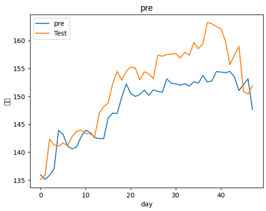
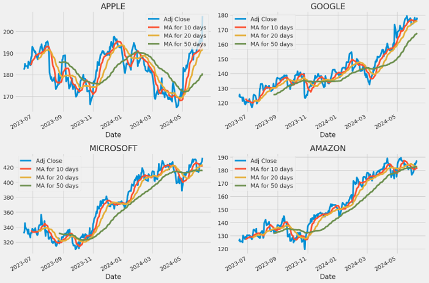
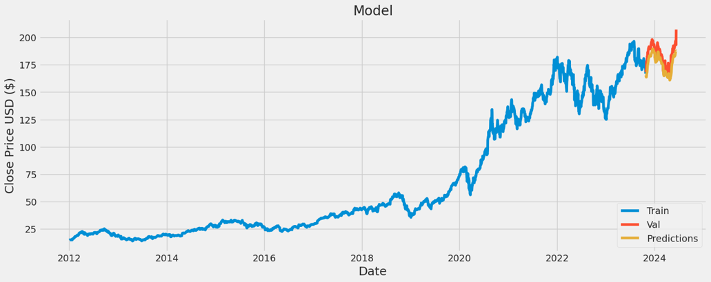
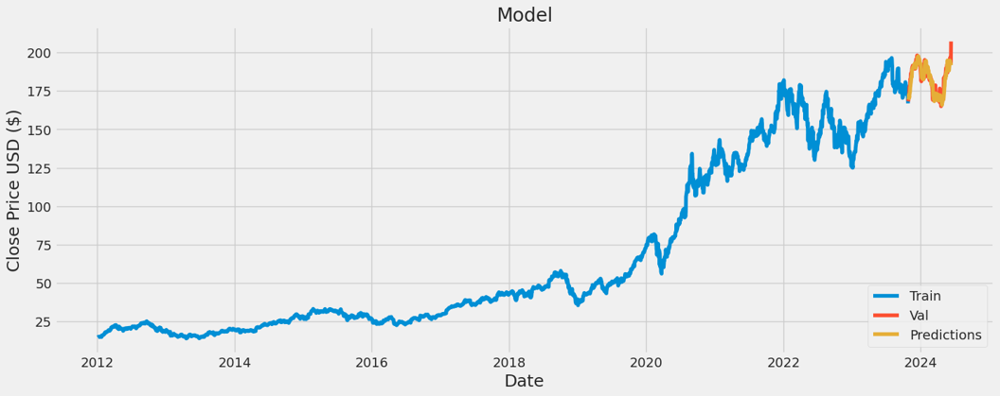

# Stock Prediction Project

## 概述

本專案旨在預測股票走勢，並利用數據分析及深度學習模型（LSTM、Transformer）進行未來股票趨勢預測。

### 專案成員
- 612415013 蕭宥羽
- 612415045 蔡媃安
- 612415103 劉哲宇
- 612415105 劉冠廷
- 612415139 馬皓煒
- 613415085 黃亮鈞

### 詳細介紹
- [mid](stock_mid/readme.md)
- [final](stock_final/readme.md)

  
## 專案資料

### 資料來源
使用 [yfinance](https://pypi.org/project/yfinance/) API 抓取以下股票資料：
- Apple
- Google
- Microsoft
- Amazon
- 0050

抓取的資料包括：日期、總成交金額、開盤價、最高價、最低價、收盤價、漲跌幅、成交量。

### 抓取區間
- Apple、Google、Microsoft、Amazon: 2012-01-01 至 2024-06-12
- 0050: 2020-05-04 至 2024-04-23

## 專案模型

### LSTM
使用LSTM模型訓練，以前n天的資料預測後一天的股價。

### Transformer
使用Transformer模型進行訓練和預測。

## 測試結果

### 0050預測結果（LSTM）
顯示LSTM模型對0050股票的預測結果。

### MA 曲線
繪製移動平均曲線來分析股價趨勢。

### 使用Apple的Close價格進行預測
- 使用LSTM模型進行預測
  
- 使用Transformer模型進行預測
  
  

### 結果比較
比較LSTM和Transformer模型的預測結果，使用RMSE（Root Mean Square Error）進行評估。

## 結論

- 專案達成目標：70%
- 主要貢獻：比較LSTM和Transformer模型在股票走勢預測上的表現。
- 未來展望：加入更多特徵和公司數據進行訓練，並結合LSTM和Transformer模型開發混合模型以充分利用兩者的優勢。

## 參考資料

- [yfinance · PyPI](https://pypi.org/project/yfinance/)
- [運用 LSTM 進行多變數股價預測](https://medium.com/@hjeremy1222/%E9%81%8B%E7%94%A8lstm%E9%80%B2%E8%A1%8C%E5%A4%9A%E8%AE%8A%E6%95%B8%E8%82%A1%E5%83%B9%E9%A0%90%E6%B8%AC-6a4eb710b745)
- [Predict stock prices using PyTorch Transformer (kaggle.com)](https://www.kaggle.com/code/hobbyai/predict-stock-prices-using-pytorch-transformer)
- [NLP 9d LSTM vs. Transformers for Stock Prediction (kaggle.com)](https://www.kaggle.com/code/selcukcan/nlp-9d-lstm-vs-transformers-for-stock-prediction)
- [Stock Market Analysis + Prediction using LSTM (kaggle.com)](https://www.kaggle.com/code/faressayah/stock-market-analysis-prediction-using-lstm)

