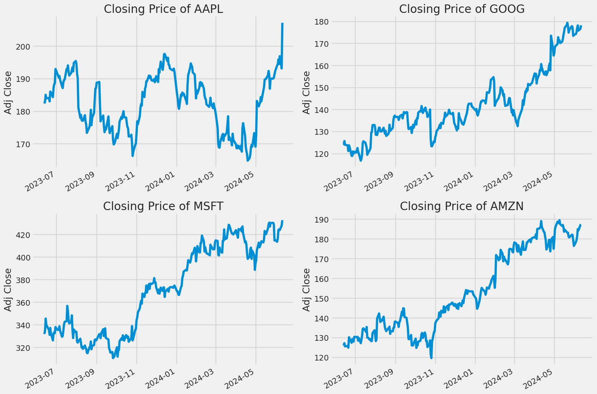
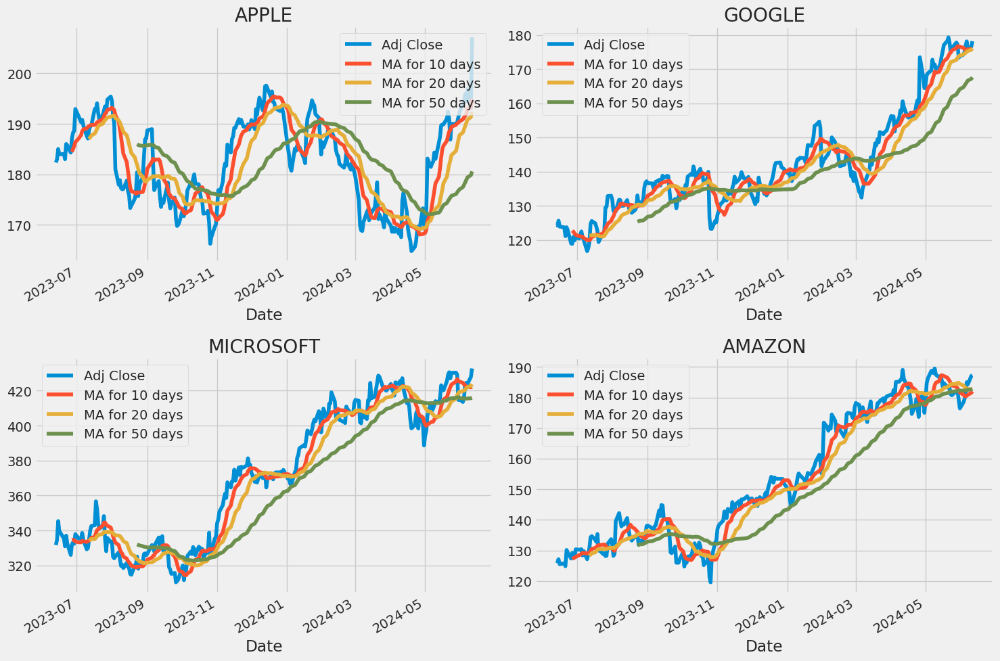

# 股市分析與預測專案

## 專案介紹

本專案使用深度學習的模型來分析和預測技術股的股價走勢。專案中我們選取了幾個主要的技術股（例如 Apple、Google、Microsoft 和 Amazon）來進行數據分析和模型訓練。

## 目錄

- [背景](#背景)
- [安裝](#安裝)
- [使用方法](#使用方法)
- [專案結構](#專案結構)
- [範例](#範例)
  - [數據抓取](#數據抓取)
  - [數據可視化](#數據可視化)
  - [移動平均線](#移動平均線)
  - [LSTM 模型](#lstm-模型)
  - [Transformer 模型](#transformer-模型)
- [貢獻](#貢獻)


## 背景

股市預測是一個具有挑戰性的任務。隨著機器學習和深度學習技術的發展，我們可以利用這些技術來分析股市數據並進行趨勢預測。本專案通過使用LSTM與Transformer模型，嘗試對主要技術股的未來股價進行預測。

## 安裝

請確保你已經安裝了以下軟體包：

```bash
pip install pandas numpy matplotlib seaborn yfinance tensorflow scikit-learn
```
## 使用方法

1.克隆此儲存庫：

```bash
git clone https://github.com/yuyu-Hsiao/CCU_DL_project.git
```

2.進入專案目錄並運行Jupyter Notebook：

```bash
cd stock_final
jupyter notebook
```

3.打開 'stock-prediction.ipynb' 文件，並依次執行每個代碼單元格。


## 專案結構
'stock-prediction.ipynb' : 主Jupyter Notebook文件，包含數據分析和模型訓練的全部過程。

## 範例
### 數據抓取
我們使用 'yfinance' 抓取技術股的歷史數據，選取的技術股包括：
- Apple (AAPL)
- Google (GOOG)
- Microsoft (MSFT)
- Amazon (AMZN)
### 數據可視化



### 移動平均線



### lstm-模型

```python
# Build the LSTM model
model = Sequential()
model.add(LSTM(128, return_sequences=True, input_shape= (x_train.shape[1], 1)))
model.add(LSTM(64, return_sequences=False))
model.add(Dense(25))
model.add(Dense(1))

# Compile the model
model.compile(optimizer='adam', loss='mean_squared_error')

# Train the model
model.fit(x_train, y_train, batch_size=1, epochs=1)
```

### transformer-模型

```python
def transformer_encoder(inputs, head_size, num_heads, ff_dim, dropout=0):
    
    # Normalization and Attention
    # "EMBEDDING LAYER"
    x = layers.LayerNormalization(epsilon=1e-6)(inputs)
    
    # "ATTENTION LAYER"
    x = layers.MultiHeadAttention(
        key_dim=head_size, num_heads=num_heads, dropout=dropout
    )(x, x)
    x = layers.Dropout(dropout)(x)
    res = x + inputs
    
    # FEED FORWARD Part - you can stick anything here or just delete the whole section - it will still work. 
    x = layers.LayerNormalization(epsilon=1e-6)(res)
    x = layers.Conv1D(filters=ff_dim, kernel_size=1, activation = "relu")(x)
    x = layers.Dropout(dropout)(x)
    x = layers.Conv1D(filters=inputs.shape[-1], kernel_size=1)(x)
    return x + res

def build_model(
    input_shape,
    head_size,
    num_heads,
    ff_dim,
    num_transformer_blocks,
    mlp_units,
    dropout=0,
    mlp_dropout=0,
):
    inputs = keras.Input(shape=input_shape)
    x = inputs
    
    for _ in range(num_transformer_blocks):  # This is what stacks our transformer blocks
        x = transformer_encoder(x, head_size, num_heads, ff_dim, dropout)

    x = layers.GlobalAveragePooling1D(data_format="channels_first")(x)
    for dim in mlp_units:
        x = layers.Dense(dim, activation="elu")(x)
        x = layers.Dropout(mlp_dropout)(x)
    outputs = layers.Dense(1, activation="linear")(x) #this is a pass-through
    return keras.Model(inputs, outputs)
```

## 貢獻

