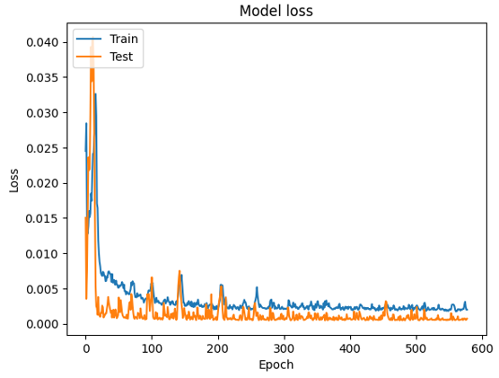
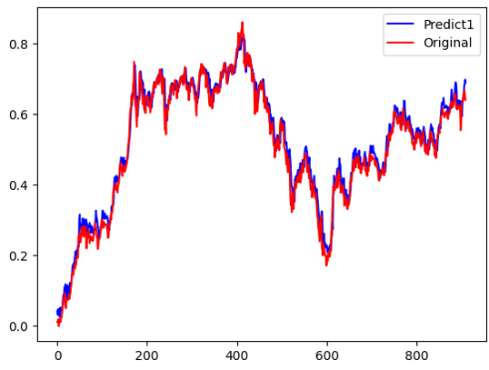
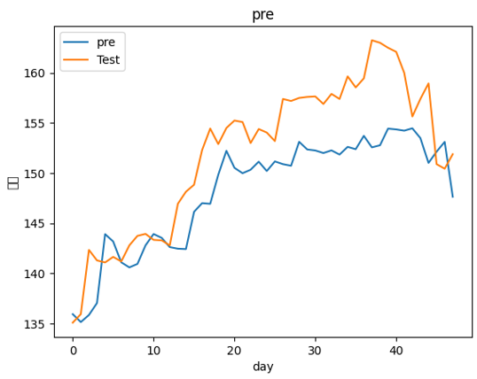

# Stock Prediction mid

## 概述
股票預測期中專案

## 專案資料

### 資料來源
抓取0050股票資料，抓取的資料包括：日期、總成交股數、總成交金額、開盤價、最高價、最低價、收盤價、漲跌幅、成交量。

### 抓取區間
- 2020-05-04 至 2024-04-23

### 資料分割
將資料按照指定的比例分割為訓練集、驗證集和測試集：
- 95% 作為訓練集和驗證集（其中訓練集佔80%，驗證集佔20%）
- 5% 作為測試集

## 專案模型

lstm

### 模型選擇
- 使用LSTM作為訓練模型
- 輸入前10天資料來預測後一天的股價

### 模型改進
- 單層LSTM效果不好，改為雙層LSTM
- 設置dropout以避免過擬合

### 訓練方法
- input length 為輸入的時間長度，設定為10天
- input_dim 為變數數量，共有8個變數

變數包括：
1. 日期 (Date)
2. 總成交股數 (Capacity)
3. 總成交金額 (Turnover)
4. 開盤價 (Open)
5. 最高價 (High)
6. 最低價 (Low)
7. 收盤價 (Close)
8. 漲跌幅 (Change)
9. 成交量 (Transaction)

## 測試結果
- Loss
  
  
  
- 使用訓練集和驗證集進行預測，效果良好
  
  
- 使用測試集進行預測，雖然結果不完全吻合，但能抓住上升和下降的趨勢
  

## 結論

- 專案達成目標：50%
- 主要貢獻：能夠預測股票基本的波動
- 未來展望：加入更多特徵進行訓練，使用Transformer等更強大的時間序列模型

